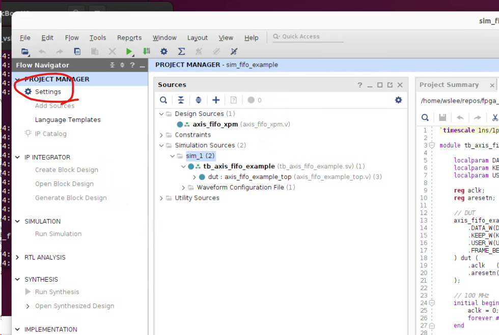
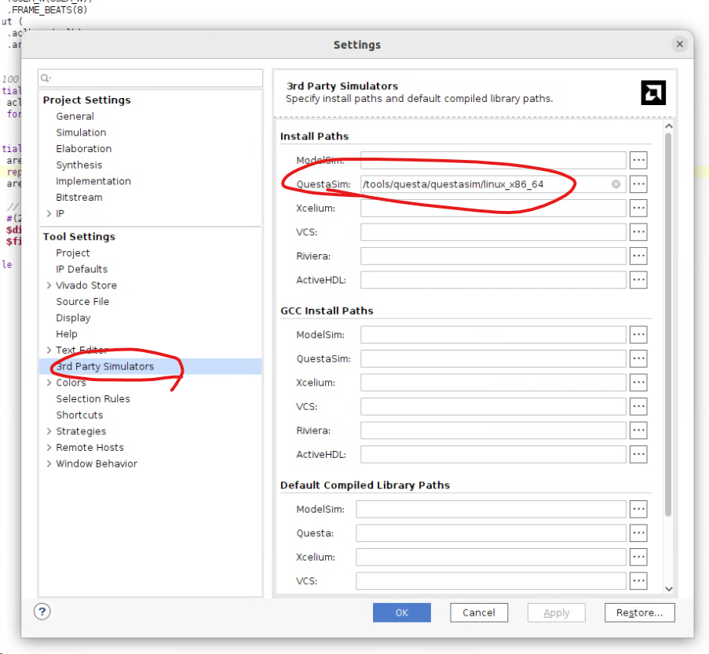
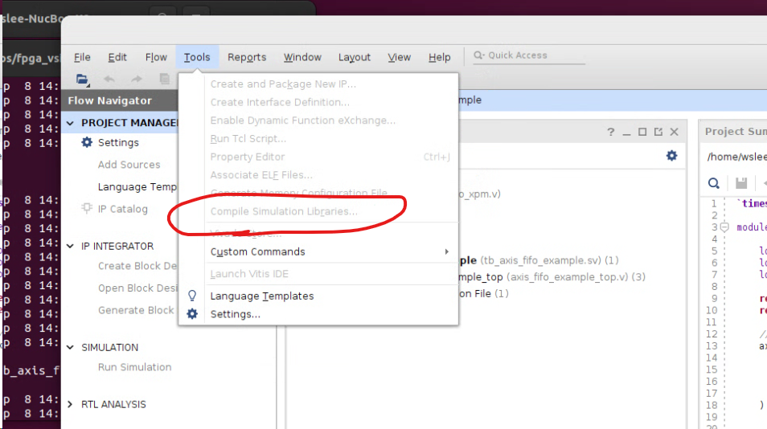
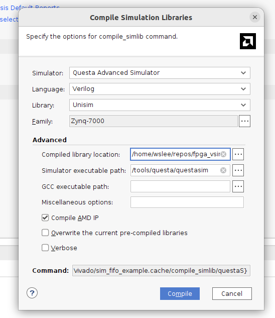
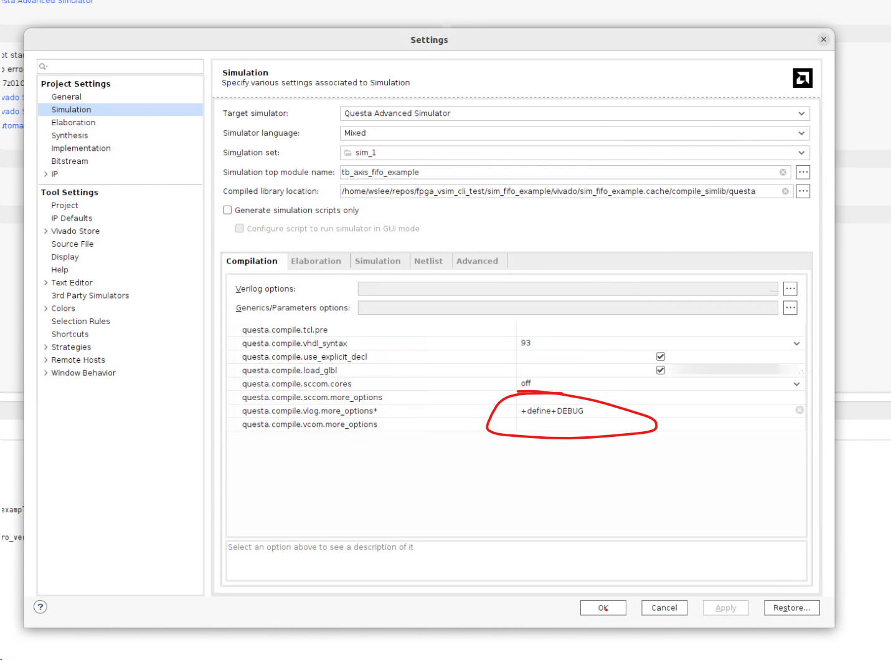
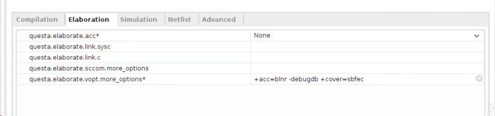
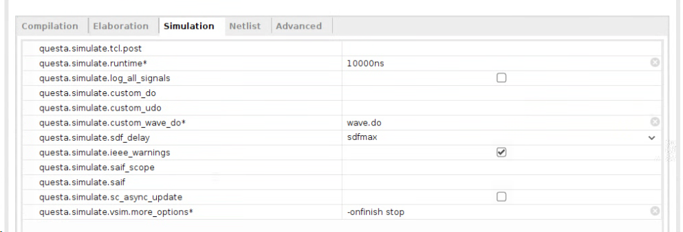

# Questa/ModelSim 설정 가이드

이 가이드는 Vivado에서 Questa/ModelSim을 설정하고 사용하는 방법을 설명합니다.

## 📋 목차
- [Questa 설치 및 설정](#-questa-설치-및-설정)
- [시뮬레이션 라이브러리 컴파일](#-시뮬레이션-라이브러리-컴파일)
- [시뮬레이션 옵션 설정](#-시뮬레이션-옵션-설정)
- [고급 디버깅 설정](#-고급-디버깅-설정)
- [팁과 권장사항](#-팁과-권장사항)

---

## 🔧 Questa 설치 및 설정

### 1. 환경 설정 진입
Vivado에서 Questa 시뮬레이터를 사용하기 위한 초기 설정을 진행합니다.



### 2. 경로 설정
Questa 실행 파일의 경로를 올바르게 설정합니다.



---

## 📚 시뮬레이션 라이브러리 컴파일

### ⚠️ 주의사항
- **컴파일 시간이 매우 오래 걸립니다** (수 ~ 수십분)
- 한 번만 수행하면 되므로 처음 설정 시에만 실행하세요(공용 폴더라면 더 좋을듯..)

### 컴파일 과정

#### 1. 컴파일 메뉴 접근


#### 2. 라이브러리 선택 및 컴파일


---

## ⚙️ 시뮬레이션 옵션 설정

### 주요 설정 항목
- 🔍 **디버그 모드**: 브레이크포인트 설정 가능
- 📊 **파형 뷰어**: 웨이브폼 자동 추가
- 🛑 **종료 방지**: 시뮬레이션 완료 후 GUI 유지

### 설정 옵션

#### 📝 Compile (vlog) 추가 옵션
```bash
+define+DEBUG
```
- 디버그 모드 활성화
- 조건부 컴파일 지원

#### 🔨 Elaboration (vopt) 추가 옵션
```bash
+acc=blnr -debugdb +cover=sbfec
```
- `+acc=blnr`: 모든 접근 권한 부여 (브레이크포인트, 라인넘버, 네트, 레지스터)
- `-debugdb`: 디버그 데이터베이스 생성
- `+cover=sbfec`: 커버리지 분석 활성화

#### 🚀 Simulation (vsim) 추가 옵션
```bash
-onfinish stop
```
- 시뮬레이션 완료 시 자동 종료 방지
- GUI에서 추가 분석 가능

---

## 🖼️ 설정 화면 참고

### 컴파일 옵션 설정 화면


### 정교화 옵션 설정 화면


### 시뮬레이션 옵션 설정 화면


---

## 💡 팁과 권장사항

### ✅ 권장 설정
1. **첫 설정 시**: 모든 라이브러리를 한 번에 컴파일
2. **디버깅 필요시**: 위의 모든 옵션 활성화
3. **빠른 검증**: 기본 옵션만 사용

### ⚡ 성능 최적화
- 불필요한 커버리지 옵션은 비활성화하여 시뮬레이션 속도 향상
- 큰 디자인의 경우 선택적으로 디버그 옵션 적용

### 🔧 문제 해결
- 라이브러리 컴파일 실패 시: 경로 설정 재확인
- 시뮬레이션 속도 느림: 디버그 옵션 일부 비활성화
- GUI 자동 종료: `-onfinish stop` 옵션 확인